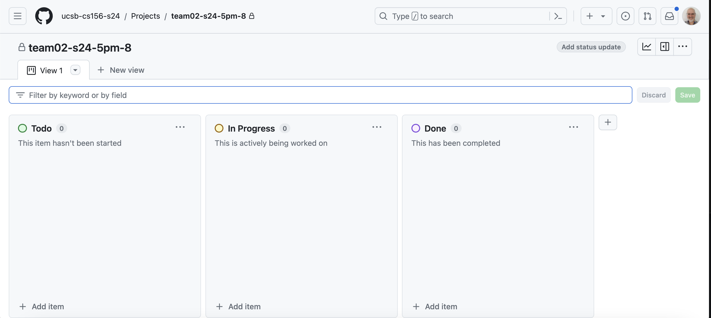
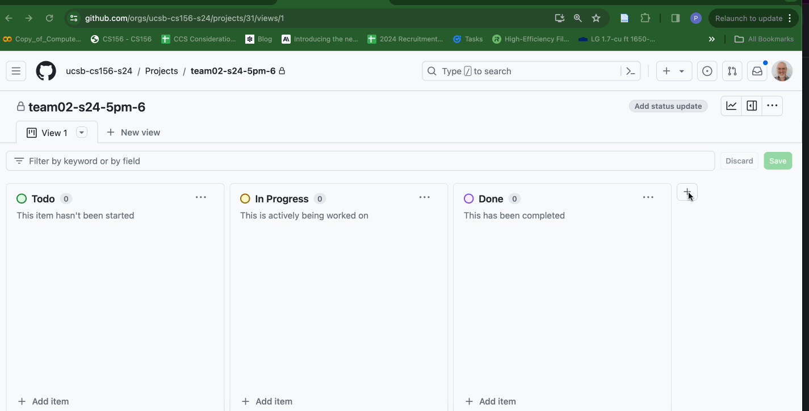

# {{page.title}}

When using Github projects, the default Kanban board often has columns only for "Todo", "In Progress" and "Done", like this:

In this course, we typically add a column between "In Progress" and "Done" called "In Review" to represent issues for which there is an open Pull Request.  Issues in the "In Review" column can be moved to
"Done" when they have been merged, typically after:
* There is at least one approving code review (or in the case of the legacy code projects, after at least one approving code review from the team, and at least one approving code review from the staff.)
* The PR is "green on CI", which means that all of the Github Actions runs have passed (have a green check instead of a red X).

That looks like this:

Here's how you add an "In Review" column.  This example can be used to add any kind of column you want.  The animation below the list of steps shows how this works.

1. Click the `+` sign at right of all of the existing columns.
2. Select `New Column` from the menu that appears.
3. In the modal (pop up) that appears, enter the title `In Review` in the `Label Text` field.
4. Select a color (we typically use `Red` for `In Review`)
5. Enter a description (we typically use `There is a pull request that needs a code review` for the `In Review` column).
6. Click Save.
7. Drag the column into place, between the `In Progress` and `Done` columns.

