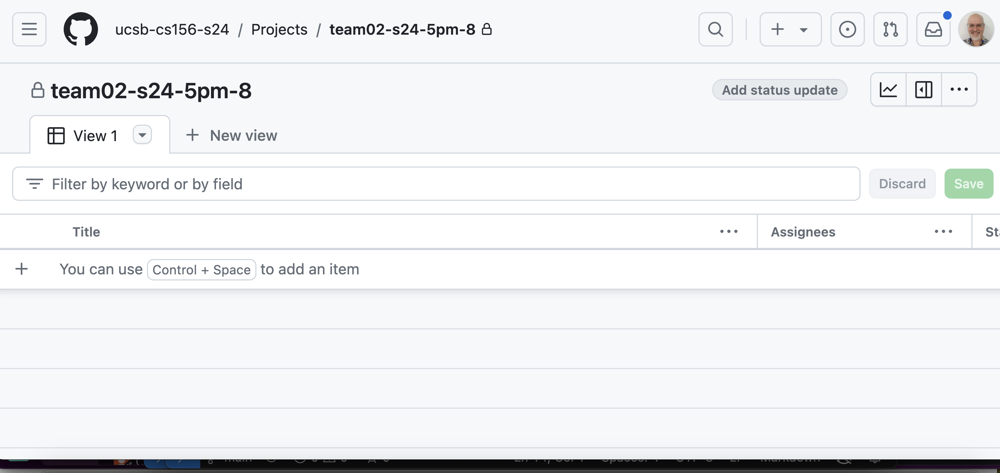
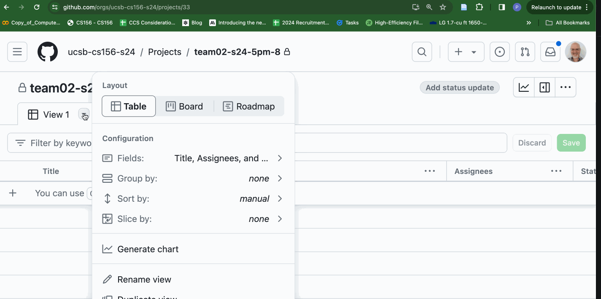

# {{page.title}}

When using Github projects, the default view is *not* a Kanban board, but a table view like this:

To change it to a Kanban board, do these steps as illustrated in the animation below:

1. Click the triangle beside the name of the view.
2. Select the tab `Board` at the top.
3. Click the green `Save` button at right so that the change is saved.

